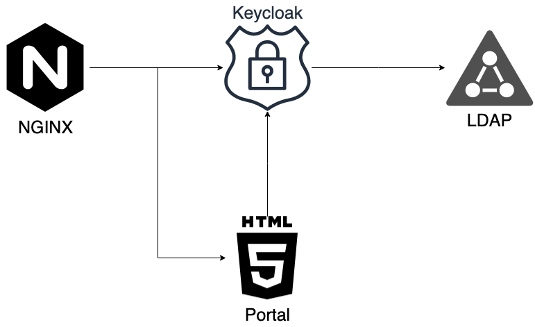

# Keycloak Playground

Este repositorio cuenta con un set de `ansible playbooks` para poder levantar un demo de autenticación con SSO, utilizando usuarios federados sobre un `LDAP`. Todos los servicios son gestionados por `docker` pero son los `playbooks` los que realmente levantan la aplicación.



## Dependencias

Es necesario contar con al menos Ansible +2.8, y los siguientes módulos de PIP:

```
Package                      Version    
---------------------------- -----------
ansible                      2.8.0      
boto                         2.49.0     
boto3                        1.9.130    
docker                       3.7.2      
docker-compose               1.24.0     
Jinja2                       2.10.1     
```

## Configuración

Las variables para ejecutar los `playbooks` se configuran por defecto en dos ubicaciones:

1. `./ansible/hosts.yml`
2. `./ansible/secret.yml`

En el primero se coloca información poco importante que basicamete se encarga de configurar el archivo `docker-compose.yml`, para administrar los servicios. Sin embargo, la información de interes
es recomendable configurarla en el segundo archivo, protegido con `ansible-vault`. Para hacer esto es necesario crear dos archivos: `./ansible/password` y el propio `./ansible/secret.yml`.

El archivo `./ansible/secret.yml` espera los siguientes datos:

```yaml
### AWS secret vars
aws_access_key: # Llave de acceso de AWS
aws_secret_key: # Llave de acceso secreta de AWS
region: # Region de AWS donde se encuentra el dominio de Route53
### Domain secret vars
zone: # Zona a la cual corresponde el dominio
domain: # Dominio sobre el cual se servira la aplicación
url: # Url sobre la cual se servira la aplicación
### Project secret vars
project_name: # Nombre del proyecto
### LDAP secret vars
ldap_dc: # Raís del árobol de LDAP
ldap_dn: # Directorio principal de LDAP. Ej: '{{ ldap_dc }},dc=example,dc=com'
ldap_admin_name: # Nombre del usuario administrador
ldap_admin_surname: # Apellido del usuario administrador
ldap_admin_username: # Usuario del usuario administrador
ldap_user_1_name: # Nombre del usuario 1
ldap_user_1_surname: # Apellido del usuario 1
ldap_user_1_username: # Usuario del usuario 1
ldap_user_2_name: # Nombre del usuario 2
ldap_user_2_surname: # Apellido del usuario 2
ldap_user_2_username: # Usuario del usuario 2
### User secret vars
email: # Email del administrador del sistema
country_name: # País donde se servira la aplicación
organization_name: # Nombre de la organización que desarrolla la aplicación
user: # Nombre de usuario del administrador del sistema
password: # Contraseña de todos los servicios del administrador del sistema
### Keycloak realm secret vars
keycloak_realm: # Nombre del Realm de Keycloak contra el cual se autenticarán los usuarios.
keycloak_realm_display_name: # Nombre a mostrar del REALM
keycloak_realm_client_resource: # Nombre del cliente dentro del REALM
keycloak_realm_ldap_name: # Nombre del recurso de usuarios federados de LDAP
keycloak_realm_ldap_user_dn: # Entry donde se encuentra la lista de usuarios. P.Ej: 'ou=users,ou=groups,dc=example,dc=com'
keycloak_realm_ldap_bind_dn: # Entry que representa un usuario con permisos de lectura del servidor LDAP. P.Ej.: 'cn=admin,dc=example,dc=com'
keycloak_realm_ldap_connection_url: # Dirección del servidor LDAP. P.Ej.: 'ldap://ldap-server:389'
### Portal secret vars
portal_prefix: # Endpoint sobre el cual se servira el portal. P.Ej.: portal.
portal_root_url: # URL raíz del portal. P.Ej.: '{{ url }}/{{ portal_prefix }}'
### Ansible user secret vars
python_interpreter: # Interprete de Python a utilizar. [OPCIONAL]
```

## Levantar la aplicación

Antes de correr la aplicación por primera vez, es necesario crear los certificados que se van a utilizar para servir la aplicación por `HTTPS`. Esto se hace ejecutando la tarea `make certificates`. Los archivos generados se podrán encontrar en la carpeta `certificates`. Esta tarea deberá ser ejecutada al menos una vez cada 60 días para refrescar los certificados, los cuales solo son valídos por 90 días.

_Puede ser necesario que deban crear las carpetas `ldap`, `portal`, y `keycloak` antes de correr la aplicación por primera vez, si no existen las mismas._

Utilizando la tarea `make up` desde la raiz del proyecto se puede levantar la aplicación. Se ejecutará un `playbook` que se encargara de:

- Crear el archivo `docker-compose.yml` a partir de un template y las variables configuradas.
- Crear archivos de configuración de otros servicios a partir de templates y las variables configuradas.

Como muchos de estos archivos de configuración contienen datos sensibles, los mismos no son almacenados en el repositorio, ni son traqueados por `git`. Es recomendable que esto permanezca así.

Una vez levantada se puede operar con los servicios de la misma utilizando `docker-compose`, u otra de las tareas definidas dentro del proyecto.

Por defecto, el proyecto esta configurado para levantar un servidor `ldap` de prueba. El mismo no cuenta con ningun dato. Sin embargo, se deja disponible un archivo en `./ldap/export.ldif` que puede importarse al servidor para inicializar la base con tres usuarios. Un administrados, y dos usuarios normales. Para importar este archivo, o realizar cualquier modificación sobre el servicio `ldap` se debe acceder a la web de gestión en la url `https://127.0.0.1:6443`. Las credenciales de acceso se configurarón en las variables de Ansible. Por ejemplo:

```
Usuario: cn=admin,dc=example,dc=com
Password: passwordsupersecreto!
```

_También se puede acceder al dashboard de Keycloak._

```
Url: https://{{ domain }}/auth
User: {{ user }}
Pass: {{ password }}
```

Sin embargo, no debería ser necesario realizar ninguna modificación sobre el mismo para que la aplicación funcione.

## Bajar la aplicación

Para dar de baja la aplicación solamente hay que correr la tarea `make down`.

## Otras tareas de interes

### `make template`

Si se realizan actualizaciones en los templates que se quieren implementar, sin tener que tirar y levantar todos los servicios, podemos utilizar este comando. El mismo construye las nuevas versiones de todos los archivos.

Despues los podemos aplicar utilizando `docker-compose` de la siguiente manera:

```
docker-compose up -d --no-deps --force-recreate --build <nombre_del_servicio>
```

### `make nginx`

Una tarea que simplifica los comandos para reiniciar le servicio de `nginx`.

### `make certificates`

Corre un `playbook` que obtiene certificados validos de `letsencrypt` y los almacena en la carpeta `certificates` desde donde los levanta `nginx`.

Es necesario aplicar una tarea programada para actualizar los certificados al menos cada 60 días. Dicha tarea, debería también reiniciar el servicio de `nginx` una vez actualizado los certificados.

## Notas

En el archivo `NOTES.md` se encuentra un resumen de información, que explica como se realizarón los `playbooks`; como se configura `nginx`; y una breve descripciónd de que es `ldap`. Es recomendable leerlo para entender porque se configurarón estos servicios de esta manera.

## Funcionamiento

La solución esta diseñada para que el encargado de autenticar a los usuarios sea Keycloak. Para esto se configura en el mismo:

1. Un nuevo realm.
2. Una nueva lista de usuarios federados a través de `ldap`.
3. Un nuevo cliente.

Para la autenticación de los usuarios es necesario dirigirse a la página del portal, `https://keycloak.example.com/portal` por ejemplo. Ni bien el usuario accede a esta página, un cliente de `keycloak` será instanciado para que verífique si el mismo se encuentra autenticado. Si este no es el caso, será redirigido al portal de autenticación del cliente, servido por Keycloak.

El estilo de este portal de autenticación puede ser modificado a través de `themes`. **Por el momento, no se ha implementado esta funcionalidad**.

Los usuarios deben colocar sus credenciales, las cuales serán validadas contra el servidor `ldap` por Keycloak. Si las mismas son validadas, el usuario será redirigido al portal original.

Esta vez, la instanicia del cliente de Keycloak validará que el cliente esta autenticado, y permitirá el ingreso del usuario a la aplicación. En este caso, lo que se muestra es un detalle de la información del usuario autenticado.